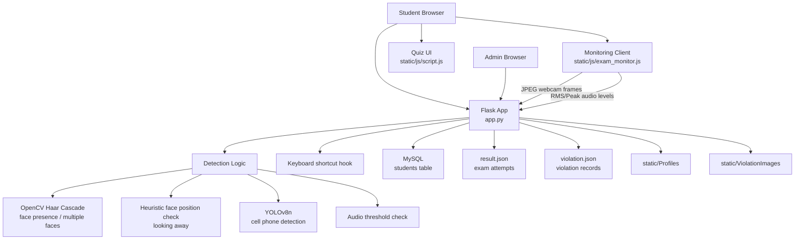
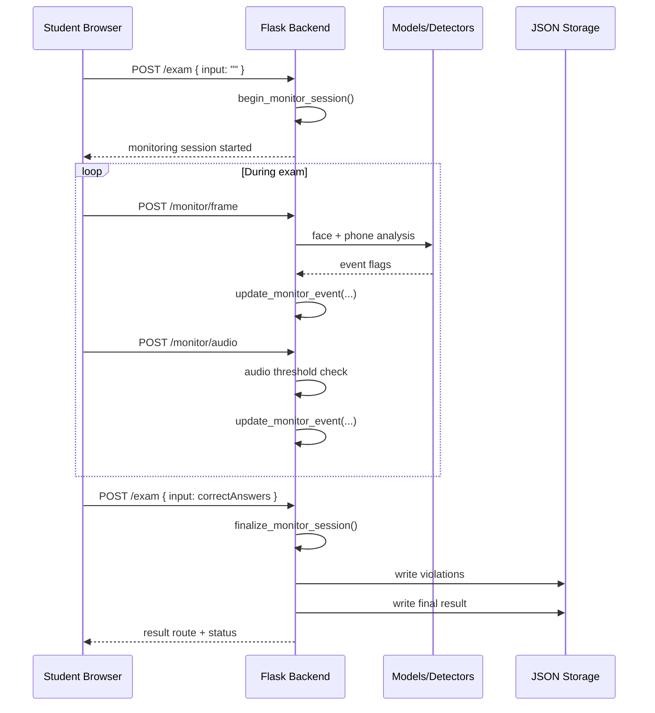

# Online Exam Proctor

A Flask-based online exam proctoring system that combines a browser exam client, webcam/audio monitoring, computer vision checks, keyboard shortcut detection, and an admin dashboard for reviewing results and violations.

This repository currently uses:

- Flask for the web app and routing
- MySQL for student/admin accounts
- JSON files for exam results and violation logs
- OpenCV Haar Cascade for face detection
- YOLOv8n for phone/object detection
- `face_recognition`/dlib for profile-face encoding, with a local stub fallback if dlib is unavailable

## Overview

The application has two user roles:

- Student: signs in, captures a profile photo, completes a system check, takes the exam, and receives a result
- Admin: signs in, manages student records, and reviews exam results and violations

The current live monitoring flow works like this:

1. The student starts the exam.
2. The browser requests webcam and microphone access.
3. The browser sends webcam frames and audio levels to Flask at intervals.
4. The backend analyzes those samples for suspicious behavior.
5. Violations are accumulated into timed events.
6. On submission, the system calculates:
   - exam score
   - total penalty
   - trust score
   - final status (`Pass`, `Fail`, or `Fail(Cheating)`)

## Architecture



## Request/Processing Flow



## Repository Structure

```text
The-Online-Exam-Proctor/
|-- app.py
|-- utils.py
|-- face_recognition_stub.py
|-- requirements.txt
|-- init_db.sql
|-- result.json
|-- violation.json
|-- yolov8n.pt
|-- Haarcascades/
|   `-- haarcascade_frontalface_default.xml
|-- templates/
|-- static/
|   |-- css/
|   |-- js/
|   |-- Profiles/
|   `-- ViolationImages/
`-- PROJECT_WORKING_DETAILED.md
```

## Features

### Student flow

- Student login and signup
- Rules page
- Face capture and confirmation
- System check page
- Browser-based exam page
- Final pass/fail result page

### Admin flow

- Admin login
- Student CRUD management
- Results listing
- Result detail view with linked violations/evidence

### Active monitoring checks

- Face absence detection
- Multiple faces detection
- Looking away from screen detection
- Mobile phone detection
- Background voice/noise detection
- Prohibited keyboard shortcut detection

## Models and Detection Components

### 1. OpenCV Haar Cascade

File:

- `Haarcascades/haarcascade_frontalface_default.xml`

Used for:

- detecting whether a face is present
- detecting multiple visible faces
- cropping the captured profile image

### 2. YOLOv8n

File:

- `yolov8n.pt`

Loaded through:

- `ultralytics.YOLO`

Used for:

- webcam object detection
- active violation trigger for `cell phone`

### 3. `face_recognition` / dlib

Used for:

- encoding known student profile images
- validating that the captured face photo contains a detectable face

Fallback:

- if `face_recognition` cannot be imported, the project falls back to `face_recognition_stub.py`

### 4. Browser audio thresholds

The current live app does not perform speech-to-text.

Instead, the browser calculates:

- RMS level
- Peak level

The backend marks audio as suspicious when thresholds are exceeded.

## Data Storage

### MySQL

MySQL stores student accounts in the `students` table.

Columns:

- `ID`
- `Name`
- `Email`
- `Password`
- `Role`

### JSON files

- `result.json`: final exam attempts
- `violation.json`: violation events per result ID

Important note:

- account data is in MySQL
- result/violation data is in JSON

That is fine for local/demo usage, but not ideal for a multi-user production deployment.

## Exam Scoring and Trust Score

At submission time:

- frontend sends number of correct answers
- backend computes:
  - `totalMark = floor(correctAnswers * 6.6667)`

Penalty marks are summed from `violation.json` for that result ID.

Stored trust score:

- `TrustScore = max(100 - totalPenalty, 0)`

Final status rules:

1. If total penalty is `>= 30`, status is `Fail(Cheating)`
2. Else if exam score is `< 50`, status is `Fail`
3. Else status is `Pass`

## Installation

### Prerequisites

- Python 3.10+ recommended
- MySQL Server running locally or remotely
- Webcam and microphone access
- Windows is the most compatible environment for the current implementation because keyboard/window monitoring libraries are Windows-oriented

### 1. Clone the repository

```bash
git clone https://github.com/abnv003/DL_Miniproject.git
cd DL_Miniproject/The-Online-Exam-Proctor
```

If your local folder is already the project root, just `cd The-Online-Exam-Proctor`.

### 2. Create a virtual environment

```bash
python -m venv .venv
```

Activate it:

Windows `cmd`:

```bat
.venv\Scripts\activate
```

Windows PowerShell:

```powershell
.venv\Scripts\Activate.ps1
```

### 3. Install dependencies

```bash
pip install -r requirements.txt
```

Notes:

- `face-recognition` may fail to install on some systems because it depends on `dlib`
- this repository includes `face_recognition_stub.py` so the app can still run in a degraded mode if `face_recognition` is unavailable
- `PyAudio` can also require platform-specific setup

### 4. Configure MySQL

The app reads these environment variables, with the following defaults:

```text
MYSQL_HOST=127.0.0.1
MYSQL_USER=root
MYSQL_PASSWORD=smith03
MYSQL_DB=examproctordb
MYSQL_PORT=3306
```

You can set them in your shell before running the app.

Windows `cmd` example:

```bat
set MYSQL_HOST=127.0.0.1
set MYSQL_USER=root
set MYSQL_PASSWORD=your_password
set MYSQL_DB=examproctordb
set MYSQL_PORT=3306
```

### 5. Initialize the database

Option A: let the app bootstrap the database and `students` table automatically on startup.

Option B: run the SQL manually:

```sql
SOURCE init_db.sql;
```

or paste the contents of `init_db.sql` into your MySQL client.

### 6. Run the application

```bash
python app.py
```

The Flask app starts in debug mode.

### 7. Open the app

Open your browser and visit:

```text
http://127.0.0.1:5000/
```

### Default admin account

- Email: `admin@example.com`
- Password: `admin123`

### Health check

Database health endpoint:

```text
http://127.0.0.1:5000/health/db
```

## Usage

### Student

1. Open the home page.
2. Choose student login.
3. Sign up or log in.
4. Read the rules.
5. Capture and confirm your face image.
6. Complete the system check.
7. Start the exam.
8. Allow webcam and microphone access.
9. Finish the quiz and submit.

### Admin

1. Open the home page.
2. Choose admin login.
3. Sign in with the admin account.
4. Review students and exam results.

## Important Implementation Notes

### Current active flow vs legacy code

This repository contains both:

- the current active browser-to-Flask monitoring flow
- older utility code in `utils.py` for head movement, screen capture, voice recording, and extended evidence generation

Most of the older utility pipeline is not wired into the current web endpoints.

### Current active checks are simpler than the legacy design

The live app currently relies on:

- face count from Haar cascade
- face-position heuristics for looking away
- YOLO cell phone detection
- browser audio thresholds

It does not currently run full continuous identity verification during `/monitor/frame`.

### Security caveat

Passwords are currently stored in plain text in MySQL. That should be replaced with hashed passwords before any real deployment.

### Concurrency caveat

The app uses several global variables, plus JSON-file writes, so it is best treated as a local/demo project rather than a production-grade concurrent system.

## Troubleshooting

### MySQL connection fails

Check:

- MySQL server is running
- host, port, username, password, and database are correct
- `/health/db` returns success

### Webcam or microphone is not working

Check:

- browser permissions are allowed
- no other app is blocking the device
- the page is opened in a supported browser

### `face-recognition` install fails

This usually means `dlib` could not be built or installed. The app may still run using `face_recognition_stub.py`, but identity verification quality will be weaker.

### No result or violation data appears

Check:

- `result.json` and `violation.json` exist and contain valid JSON arrays
- the app process has permission to write to the repository folder

## Documentation

Additional implementation details are documented in [PROJECT_WORKING_DETAILED.md](./PROJECT_WORKING_DETAILED.md).

## Tech Stack

- Python
- Flask
- Flask-MySQLdb
- MySQL
- OpenCV
- Ultralytics YOLOv8
- face_recognition / dlib
- MediaPipe
- NumPy
- PyAudio
- keyboard
- PyAutoGUI
- PyGetWindow
- HTML/CSS/JavaScript

## License

No license file is currently included in this repository.
